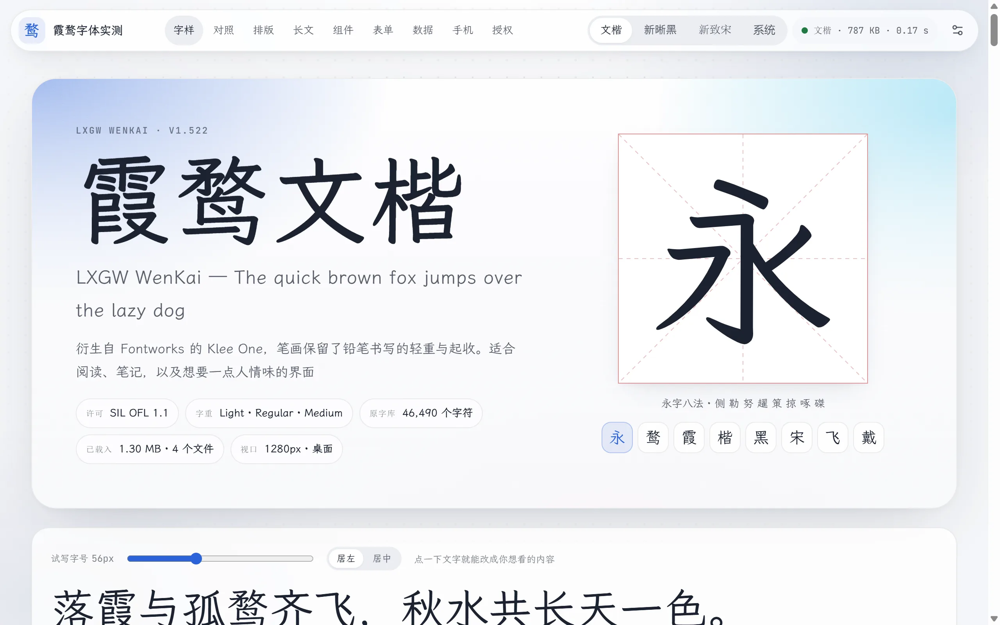
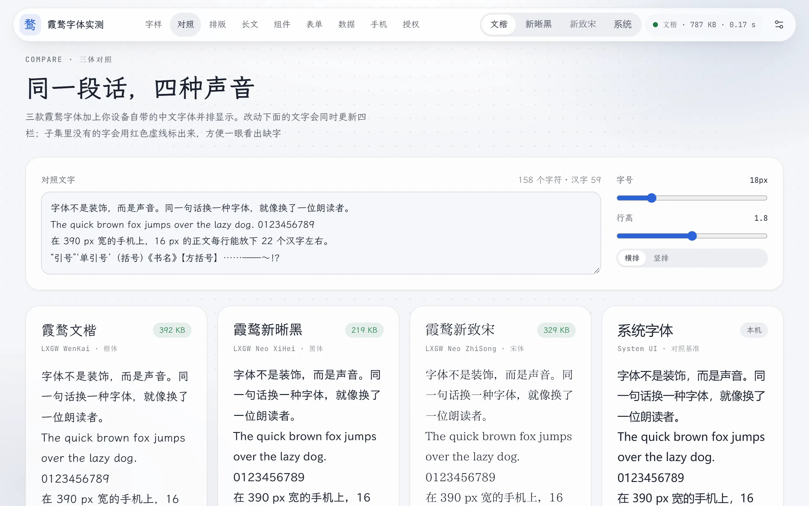
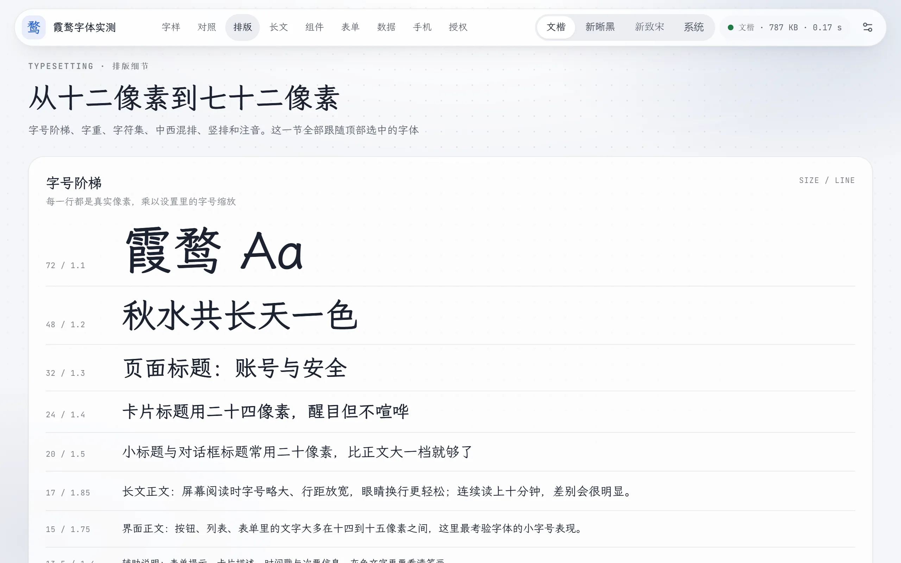
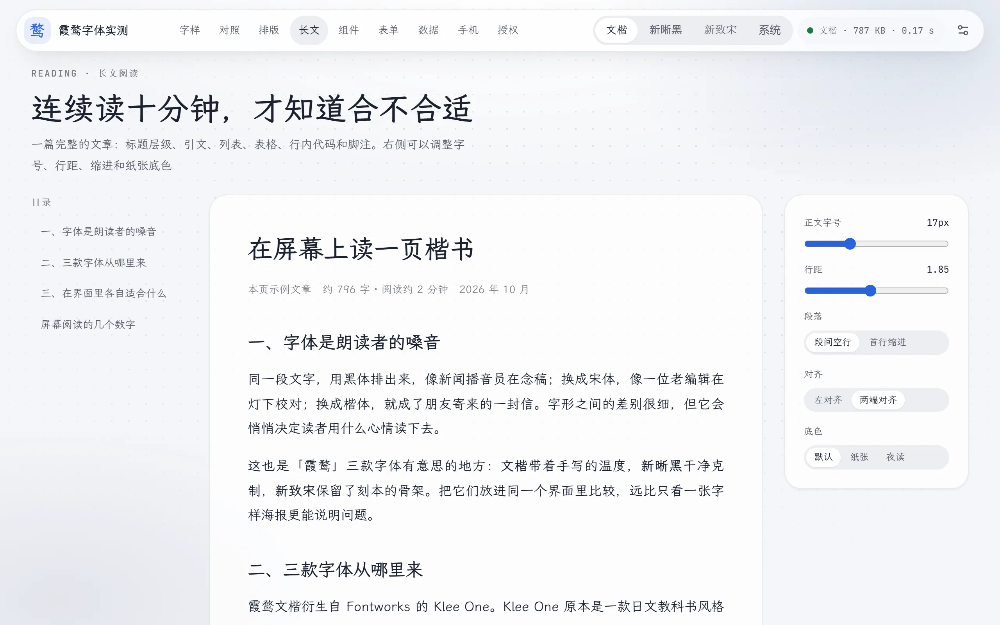

# 霞鹜字体实测

[](https://github.com/sj817/lxgw-font-lab/actions/workflows/pages.yml)

把霞鹜文楷、霞鹜新晰黑、霞鹜新致宋放进网页实际场景里看真实排版效果，按钮、表单、表格、长文都排了一遍，顶栏可以随时切换字体对比

在线地址：<https://sj817.github.io/lxgw-font-lab/>



<details>
<summary>展开查看更多界面截图（对照、排版、长文、组件、表单、数据、手机屏、深色模式）</summary>

<p>
  
  
</p>
<p>
  
  
</p>
<p>
  
  
</p>
<p>
  
  
</p>

</details>

## 本地跑

需要 Python 3.10+

```sh
pip install -r requirements.txt
python scripts/build.py
python -m http.server -d dist
```

然后打开 <http://localhost:8000> 就能看

两点说明：
- 第一次构建要从 lxgw 的 GitHub Releases 下载原始 TTF，大概 140 MB，存在 `.cache/fonts/` 里，之后不会重复下载
- 直接双击 `dist/index.html` 也能看，只是浏览器安全策略会导致扩展字表在 `file://` 下加载不了，本地调试建议起 HTTP 服务

## 字体怎么切

中文字体体积偏大，直接全量加载不现实，字形本身没改过，纯粹用 fontTools 取子集再转成 woff2

每个字重切成三份：
- 页面上出现的字连同常用符号打成一份，base64 直接内嵌进 `index.html`，首屏零额外请求，打开就有字
- GB2312 一级字和二级字各单切一份，在输入框里打了内嵌那份没有的字，或者点了授权一节的「下载当前字体的扩展字表」，才会去下载
- 代码块用的霞鹜文楷 Mono 单独切了一小份

## 升级字体

改 `fonts.json` 里的 tag 和 sha256，上游的 sha256 可以这样查：

```sh
gh api repos/lxgw/LxgwWenKai/releases/latest --jq '.assets[] | .name + " " + .digest'
```

页面授权那一节也写着版本号，要一起改，两边对不上构建脚本会直接报错退出

推到 `main` 分支后 GitHub Actions 会自动重新构建并发布到 Pages

## 授权

代码用 [MIT](LICENSE)

字体版权归落霞孤鹜和原字体的权利人，仓库里不放字体文件，站点上的子集沿用原授权，协议全文在 [licenses](licenses) 目录，部署时会和字体文件放在一起：

- 霞鹜文楷 v1.522，基于 Klee One，[SIL OFL 1.1](licenses/OFL-LXGWWenKai.txt)
- 霞鹜新晰黑 v1.305，基于 IPAex Gothic，[IPA Font License 1.0](licenses/IPA-LXGWNeoXiHei.md)
- 霞鹜新致宋 v1.067，基于 IPAex Mincho 和 IPAmj Mincho，[IPA Font License 1.0](licenses/IPA-LXGWNeoZhiSong.md)

IPA 授权要求写明怎么换回原版字体：到 <https://moji.or.jp/ipafont/ipafontdownload/> 下载 IPAex ゴシック 或 IPAex 明朝 装到电脑上，在页面里选「系统」，再把它设成系统字体

To replace the derived fonts with the original IPA fonts, get them from <https://moji.or.jp/ipafont/ipafontdownload/>
